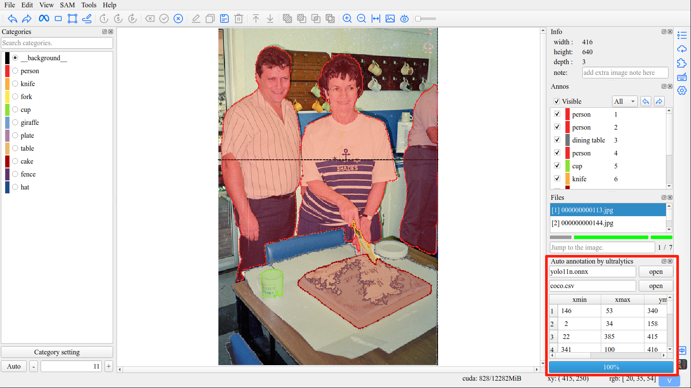

# ISAT插件 - 自动标注

这是一个[ISAT](https://github.com/yatengLG/ISAT_with_segment_anything)的插件开发示例。

仅使用240行代码，开发一个带界面的ISAT插件，为ISAT提供基于yolo目标检测模型的自动标注功能。



## 功能

* 可导入其他模型（项目提供了yolo11n.onnx模型供测试）
* 兼容IAST，支持所有ISAT提供的sam模型

## 安装与使用

### 安装

```shell
pip install isat-plugin-auto-annotate
```

### 使用

- 运行isat
- 插件界面，激活AutoAnnotatePlugin，在插件界面选择提供的yolo11n.onnx模型与coco.csv类别文件
- 选择sam模型(经不严谨测试，原始sam模型对框提示效果最好)
- 每次切换图片后，自动开始标注当前图片

## 说明

### 模型文件
项目使用带**nms**的onnx模型。

支持所有经nms后输出shape为[n, 6]格式数据的模型，具体表示n个[xmin, ymin, xmax, ymax, score, category_index]

以ultralytics导出yolov11模型为例：
```shell
yolo export model=path/to/yolo11n.pt format=onnx nms=True iou=0.45
```

### 类别文件

类别文件使用cvs格式存储，每行一个类别，分别与category_index对应。

以coco数据集为例：

```text
person
bicycle
car
motorcycle
airplane
bus
train
truck
...
```

模型输出的category_index 0 对应person, 1对应bicycle, ...